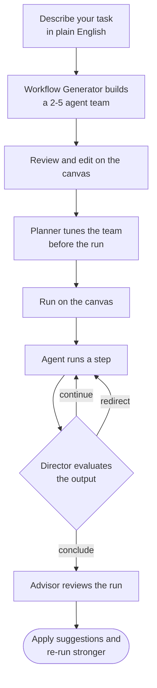
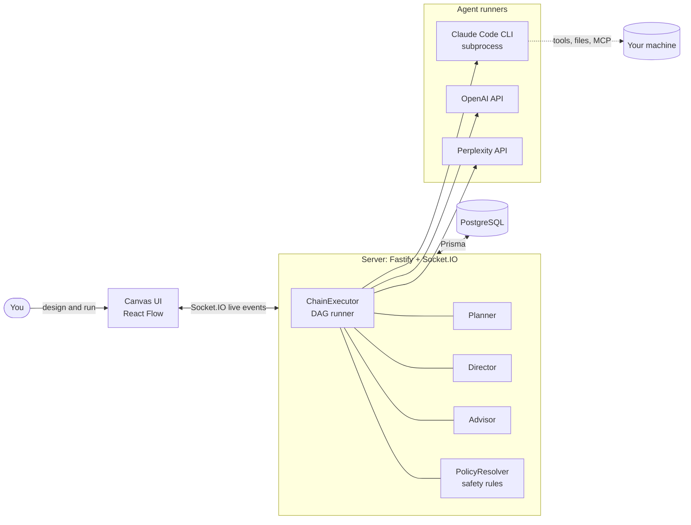
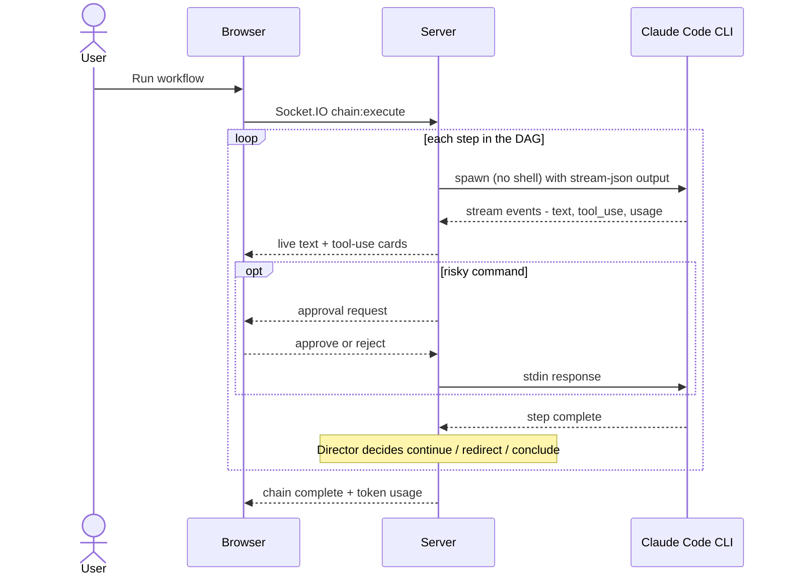

<div align="center">

# RondoFlow

**Build teams of Claude Code agents - visually.**

Describe what you need on a drag-and-drop canvas, and RondoFlow assembles a team of
specialized AI agents that plan, run, and improve the work together - locally, on your
machine, with your files.

[](LICENSE)


</div>

## What is RondoFlow?

Most "AI workflow" tools wire prompts together. RondoFlow orchestrates **real
[Claude Code](https://docs.anthropic.com/en/docs/claude-code) agents** - so the agents on your
canvas can actually read and write files, run commands, and use MCP tools and skills, all
governed by safety policies you control. You compose them visually, hit **Run**, and watch the
team execute in real time.

**Why it's different**

- 🧩 **Visual multi-agent canvas** - drag agents, skills, safety rules, resources, and MCP
  connections onto a [React Flow](https://reactflow.dev) board and connect them into a workflow.
- 🤖 **Real agents that *do* things** - agents are Claude Code CLI subprocesses, not just chat
  completions. They edit code, run tools, and stream their work back live.
- 🎯 **AI that steers the run** - a **Director** evaluates each step mid-run and decides whether
  to continue, retry, or conclude; a **Planner** tunes the team before it starts; an **Advisor**
  reviews the result afterward.
- 🔌 **Multi-provider** - mix **Claude Code** (local CLI), **OpenAI**, and **Perplexity** agents
  in the same workflow.
- 🔒 **Local-first & policy-governed** - runs on your machine, talks to your files, and gates
  risky actions behind a three-layer safety model. Nothing leaves your box except the model API
  calls you configure.


## Table of Contents

- [Features](#features)
- [How It Works](#how-it-works)
- [Documentation](#documentation)
- [Configuration](#configuration)
- [Development](#development) 
- [Architecture](#architecture)
- [Contributing](#contributing)
- [Security](#security)
- [License](#license)


### Local development

```bash
git clone https://github.com/rondoflow/rondoflow.git
cd rondoflow
npm run setup    # installs deps, generates .env, starts Postgres, migrates + seeds
npm run dev      # opens at http://localhost:3000
```

### Full Docker (everything in containers)

```bash
git clone https://github.com/rondoflow/rondoflow.git
cd rondoflow
cp .env.example .env   # edit .env (see Configuration below)
docker compose up      # builds and starts all services
```

This starts five containers:

| Container | Port | Role |
|-----------|------|------|
| `rondoflow-postgres` | 5432 | PostgreSQL database |
| `rondoflow-server` | 3001 | Fastify backend + Socket.IO + Claude Code CLI |
| `rondoflow-ui` | 3000 | Next.js frontend |
| `rondoflow-docs` | 3002 | Nextra documentation site (proxied at `/docs`) |
| `rondoflow-migrate` | - | Runs database migrations once, then exits |

Then open **[http://localhost:3000](http://localhost:3000)**.

> Docker mode needs **Docker Desktop only** - Node.js is not required on the host.

### First run

RondoFlow is **invite-only** - open self-registration is disabled, and an admin creates all
accounts. Set `RONDOFLOW_ADMIN_EMAIL` and `RONDOFLOW_ADMIN_PASSWORD` in `.env` *before* you run
setup; the seed step then bootstraps that first admin (it's skipped if either is blank).

- **Option A (local):** `npm run setup` runs the seed for you, so the admin is created automatically.
- **Option B (Docker):** the `rondoflow-migrate` container runs migrations only - run the seed step
  yourself (`npm run db:seed`, with the admin vars set and Postgres reachable) to create the first admin.

Sign in with that account (email/password). On first sign-in a
short onboarding wizard walks you through picking a working directory and a work mode (*Quick
Start* - describe a task and let RondoFlow build the team - or *Full Control* - assemble agents by
hand). Admins can then create accounts for teammates from the **Users** panel. If the Claude Code
CLI isn't detected, the app shows install instructions and waits.

## Features

### Visual canvas

Drag nodes onto an interactive board and connect them to define how work flows. Everything
auto-saves.

| | |
|---|---|
| **Node types** | Assistants (agents), Skills, Safety Rules, Resources, Connections (MCP), Output, Condition (branching), Sticky Notes |
| **Connections** | Flow edges (execution order), association edges (configuration), and conditional edges (branching from a Condition node) |
| **Interaction** | Drag-and-drop palette, undo/redo (`Ctrl+Z`), keyboard shortcuts (`?`), command palette (`Ctrl+K`) |
| **Workspaces** | Multiple project-based workspaces, each tied to a folder on your machine; export/import to share |

### Assistants & providers

Each Assistant has a provider, model, personality, skills, memory, and MCP connections - all
configurable from the side panel.

| Provider | Models | Notes |
|----------|--------|-------|
| **Claude Code** *(default)* | Opus / Sonnet / Haiku tiers | Runs the local CLI; full tool, MCP, and skill access |
| **OpenAI** | GPT / o-series | API-based; optional web search |
| **Perplexity** | Sonar family | API-based; web-grounded research |

The Workflow Generator picks a sensible model per agent automatically - you can always change it.

### Smart execution - Planner, Director & Advisor

Three AI helpers reason *about* your run at different points:

- **Planner** *(before)* - reviews the team, models, skills, and order; suggests improvements up front.
- **Director** *(during)* - after each step, decides `continue` / `redirect` (retry with sharper
  instructions) / `conclude`, with a tunable criticism level and learnings it banks for next time.
- **Advisor** *(after)* - compares the result against the objective and offers one-click fixes.

### Team Discussions

Multiple Assistants brainstorm, review, or debate a topic while an automated **Facilitator**
manages turn order and synthesizes a conclusion.

### Workflow generation

Describe a task in plain English and RondoFlow designs a 2–5 agent workflow with personas,
models, and skills, laid out as a DAG. Review and edit it before it hits the canvas - or start
from a built-in template (Code Review, Content Team, Research, Brainstorm).

### Skills

Skills are reusable instruction sets that give Assistants specialized abilities. RondoFlow ships
built-in skills (Code Review, Writing Assistant, Data Analysis, API Designer, Test Writer) and
you can install more from any Git repository.

### Safety first

Three layers of policies - **global**, **per-agent**, and **per-session** - control what agents
may do. The most restrictive policy always wins, risky commands require your approval, and budget
limits prevent runaway costs. See [SECURITY.md](SECURITY.md) for the full model.

### Users & roles

RondoFlow runs as a shared team workspace with three global roles: **viewer** (read-only),
**editor** (create, edit, delete, and run workflows - Director / Planner / Advisor / Discussions
included), and **admin** (everything an editor can do, plus user management and global settings).
Accounts are **invite-only** - admins create users with a starting role from a **Users** panel and
can change roles or deactivate/remove accounts; there is no open self-registration. Roles are
enforced server-side on both the REST API and the realtime socket layer (viewers get a read-only
canvas - palette hidden, nodes locked), and the UI mirrors those capabilities to hide affordances a
role can't use. Admin user-management actions are written to the audit log.

### More

Recurring **Schedules** (cron), iterative **Loops** (re-run an agent until a goal is met), an
in-app **Git** panel (status, branches, commit, push), **Memory** that persists facts across runs,
**external folder** mounts, and an **audit log** + **analytics** dashboard for monitoring and cost
tracking.

## How It Works

1. **Describe** what you need in plain English - or pick a template.
2. **Review** the AI-generated team of agents with their providers, models, and skills.
3. **Run** the workflow on the canvas - watch agents execute in real time, with the Director
   steering between steps.
4. **Improve** with Advisor analysis and one-click suggestions after each run.



## Documentation

RondoFlow ships a full documentation site (built with [Nextra](https://nextra.site)) in
[`packages/docs`](packages/docs). Run it locally with:

```bash
npm run dev:docs   # http://localhost:3002/docs
```

## Configuration

`npm run setup` generates a `.env` automatically. For Docker mode, copy `.env.example` and set:

- **`BETTER_AUTH_SECRET`** - a random string, e.g. `openssl rand -hex 32`.
- **A Claude credential** (required for Claude Code agents) - either **`ANTHROPIC_API_KEY`** (an
  Anthropic API key) **or** **`CLAUDE_CODE_OAUTH_TOKEN`** from `claude setup-token` to use your
  Claude subscription. If both are set, the setup token wins.
- **Claude Code telemetry** - set **`CLAUDE_CODE_ENABLE_TELEMETRY`**, **`OTEL_METRICS_EXPORTER`**,
  **`OTEL_LOGS_EXPORTER`**, **`OTEL_EXPORTER_OTLP_PROTOCOL`**, and either the direct OTEL values
  (`OTEL_EXPORTER_OTLP_ENDPOINT`, `OTEL_EXPORTER_OTLP_HEADERS`, `OTEL_RESOURCE_ATTRIBUTES`) or the
  source vars they derive from (`OTEL_ENDPOINT`, `AUTH_TOKEN`, `USER_EMAIL`). The server forwards
  these into spawned Claude Code processes.
- **`RONDOFLOW_ADMIN_EMAIL` / `RONDOFLOW_ADMIN_PASSWORD`** - bootstrap the first admin account.
  Required to get into a fresh instance, since self-registration is disabled (see [First run](#first-run)).

| Variable | Required | What it does |
|----------|----------|-------------|
| `DATABASE_URL` | Auto | PostgreSQL connection string |
| `BETTER_AUTH_SECRET` | **Yes** | Session encryption - random, never commit |
| `BETTER_AUTH_URL` | Auto | Backend URL |
| `RONDOFLOW_ADMIN_EMAIL` | First run | Email for the bootstrap admin, created at seed time (RondoFlow is invite-only) |
| `RONDOFLOW_ADMIN_PASSWORD` | With email | Password for the bootstrap admin - set alongside the email, then rotate after first login |
| `RONDOFLOW_ADMIN_NAME` | No | Display name for the bootstrap admin (default `Administrator`) |
| `ANTHROPIC_API_KEY` *or* `CLAUDE_CODE_OAUTH_TOKEN` | For agents | Claude credential (setup token wins if both set) |
| `CLAUDE_CODE_ENABLE_TELEMETRY` / `OTEL_METRICS_EXPORTER` / `OTEL_LOGS_EXPORTER` / `OTEL_EXPORTER_OTLP_PROTOCOL` | No | Enable Claude Code telemetry export when spawning agents |
| `OTEL_ENDPOINT` / `AUTH_TOKEN` / `USER_EMAIL` | No | Convenience source vars used to derive `OTEL_EXPORTER_OTLP_ENDPOINT`, `OTEL_EXPORTER_OTLP_HEADERS`, and `OTEL_RESOURCE_ATTRIBUTES` |
| `OTEL_EXPORTER_OTLP_ENDPOINT` / `OTEL_EXPORTER_OTLP_HEADERS` / `OTEL_RESOURCE_ATTRIBUTES` | No | Direct telemetry overrides forwarded to Claude Code if you prefer to set OTEL values explicitly |
| `GITHUB_CLIENT_ID` / `GITHUB_CLIENT_SECRET` | No | Enable GitHub login |
| `GOOGLE_CLIENT_ID` / `GOOGLE_CLIENT_SECRET` | No | Enable Google login |

> **Invite-only.** Open self-registration is disabled - an admin creates all accounts. When
> `RONDOFLOW_ADMIN_EMAIL` and `RONDOFLOW_ADMIN_PASSWORD` are both set, the seed step (`npm run
> db:seed`, run for you by `npm run setup`) creates the first admin; leave both blank to skip.

OpenAI and Perplexity API keys are configured in the app's Settings (instance-wide, shared by all
agents of that provider).

### Email (SMTP)

The **Email node** sends a workflow's output via SMTP. Configure it with `SMTP_*` in `.env`, or at
runtime in **Settings → Credentials** (a DB-stored value overrides `.env`; `SMTP_PASS` is stored
encrypted). Leave `SMTP_HOST` blank to disable.

| Variable | Default | What it does |
|----------|---------|-------------|
| `SMTP_HOST` | - | SMTP server hostname (blank disables email) |
| `SMTP_PORT` | `587` | SMTP port |
| `SMTP_SECURE` | `false` | `true` for implicit TLS (465), `false` for STARTTLS (587) |
| `SMTP_USER` / `SMTP_PASS` | - | SMTP credentials (`SMTP_PASS` encrypted if set in Settings) |
| `SMTP_FROM` | - | From address, e.g. `RondoFlow <noreply@example.com>` |

### Optional tuning

`.env.example` also documents optional variables not needed for a basic run:

| Variable | Default | What it does |
|----------|---------|-------------|
| `PORT` / `UI_ORIGIN` | `3001` / `http://localhost:3000` | Backend port and allowed UI origin (CORS) |
| `CLAUDE_CODE_MAX_OUTPUT_TOKENS` | `128000` | Max output tokens per agent response (clamped to each model's true max) |
| `EXTERNAL_FOLDERS_HOST_PATH` / `EXTERNAL_FOLDERS_CONTAINER_ROOT` | `./external` / `/external` | Host directory bind-mounted into the server container, and the in-container root mounted folders resolve under (backs external-folder mounts) |
| `RONDOFLOW_SPAWN_IDLE_TIMEOUT_MS` / `RONDOFLOW_SPAWN_MAX_MS` | `300000` / `0` | Kill a run after this many ms with no stream events / absolute wall-clock cap per spawn (`0` disables) |
| `RONDOFLOW_TEARDOWN_ON_DISCONNECT` / `RONDOFLOW_TEARDOWN_GRACE_MS` | `1` / `60000` | Tear down a user's in-flight runs after their last tab disconnects, following a grace window |


## Development

```bash
npm run dev              # start everything (turbo)
npm run dev:ui           # frontend only (port 3000)
npm run dev:server       # backend only (port 3001)
npm run dev:docs         # docs site only (port 3002)
npm run build            # build all packages
npm run lint             # lint all packages
npm run format           # format with Prettier
npm run test             # run all tests (turbo)
npm run test:coverage    # run all tests with coverage
npm run db:migrate       # run database migrations
npm run db:seed          # load sample data (and bootstrap the admin)
npm run db:studio        # visual database browser
npm run docker:up        # start PostgreSQL only (for local dev)
npm run docker:down      # stop containers
```

> **Tests:** both the `server` and `ui` packages use [Vitest](https://vitest.dev). `npm run test`
> runs the whole suite via the `turbo test` task; scope to one package with
> `npm test -w @rondoflow/server` or `npm test -w @rondoflow/ui`. The same lint / build / test
> sequence runs in CI ([`.github/workflows/ci.yml`](.github/workflows/ci.yml)).

## Architecture

A canvas talks to a server over websocket. The server's engine walks your
workflow as a DAG, runs each agent through the right provider, and gates risky actions behind
the policy layer.



A run streams back live - here's the flow for a single Claude Code agent step:



## Contributing

Contributions are welcome! Please read **[CONTRIBUTING.md](CONTRIBUTING.md)** for setup, code
conventions, and the PR process. In short:

```bash
# Fork, clone, then:
npm run setup
npm run dev

# Before submitting a PR:
npm run build && npm run lint
```

Bug reports and feature requests go through the [issue templates](.github/ISSUE_TEMPLATE). By
contributing, you agree your work is licensed under the project's MIT license.

## Security

RondoFlow runs AI agents that can execute code on your machine, so please review the threat model
and deployment guidance in **[SECURITY.md](SECURITY.md)** before exposing it beyond localhost.
Found a vulnerability? Report it privately via GitHub's
[security advisories](https://github.com/rondoflow/rondoflow/security/advisories/new) - please don't
open a public issue.

## License

[MIT](LICENSE) © RondoFlow contributors. Third-party dependency licenses are summarized in
[THIRD_PARTY_NOTICES.md](THIRD_PARTY_NOTICES.md).
