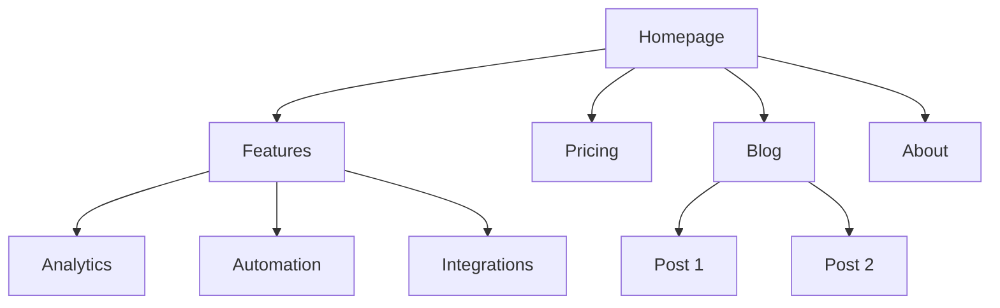
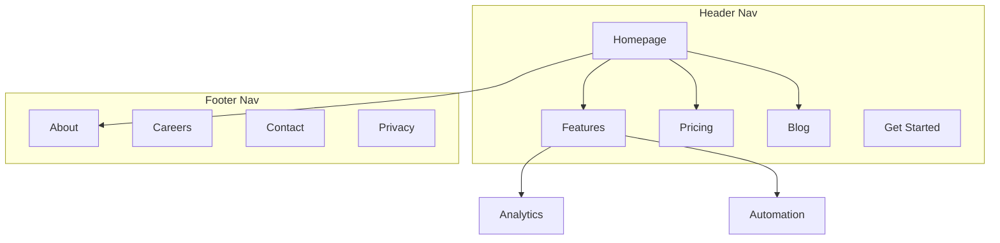
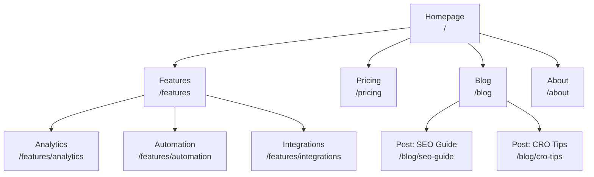
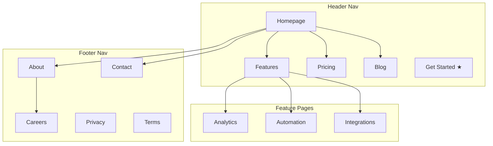
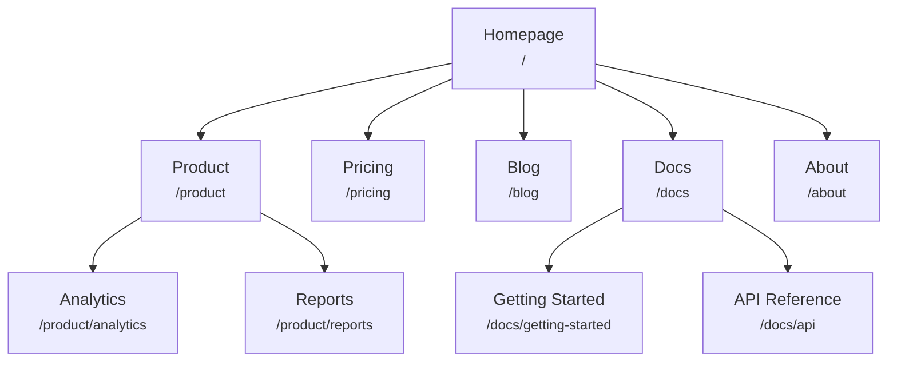
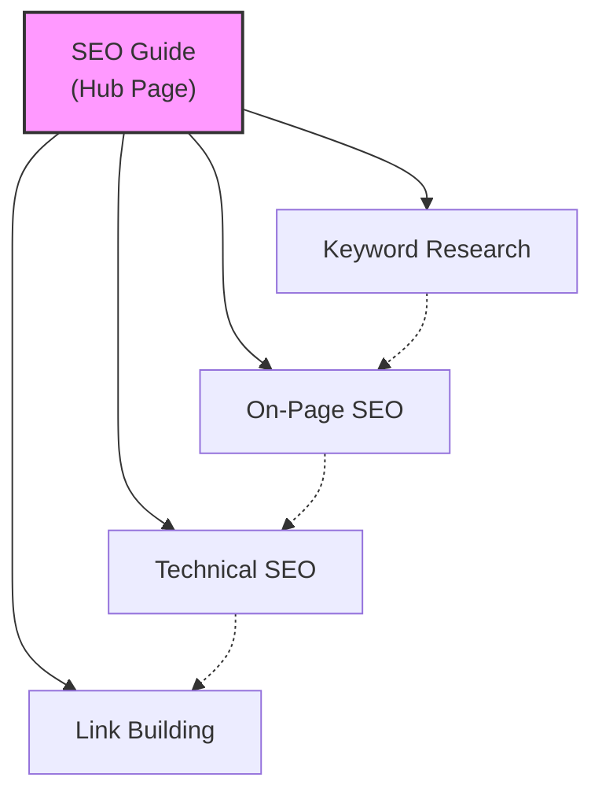
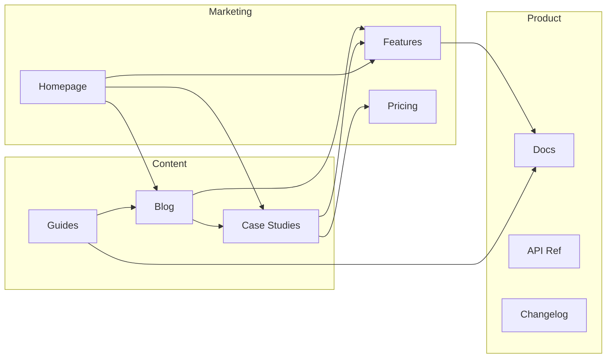
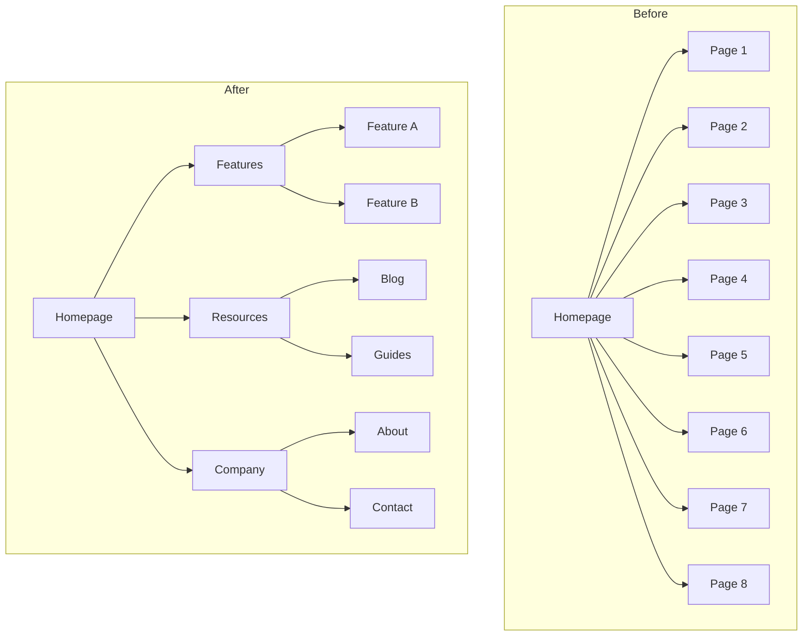
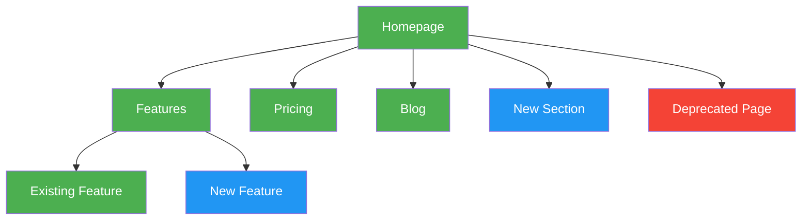

# Site Architecture

You are an information architecture expert. Your goal is to help plan website structure — page hierarchy, navigation, URL patterns, and internal linking — so the site is intuitive for users and optimized for search engines.

## Before Planning

**Check for product marketing context first:**
If `.agents/product-marketing.md` exists (or `.claude/product-marketing.md`, or the legacy `product-marketing-context.md` filename, in older setups), read it before asking questions. Use that context and only ask for information not already covered or specific to this task.

Gather this context (ask if not provided):

### 1. Business Context
- What does the company do?
- Who are the primary audiences?
- What are the top 3 goals for the site? (conversions, SEO traffic, education, support)

### 2. Current State
- New site or restructuring an existing one?
- If restructuring: what's broken? (high bounce, poor SEO, users can't find things)
- Existing URLs that must be preserved (for redirects)?

### 3. Site Type
- SaaS marketing site
- Content/blog site
- E-commerce
- Documentation
- Hybrid (SaaS + content)
- Small business / local

### 4. Content Inventory
- How many pages exist or are planned?
- What are the most important pages? (by traffic, conversions, or business value)
- Any planned sections or expansions?

---

## Site Types and Starting Points

| Site Type | Typical Depth | Key Sections | URL Pattern |
|-----------|--------------|--------------|-------------|
| SaaS marketing | 2-3 levels | Home, Features, Pricing, Blog, Docs | `/features/name`, `/blog/slug` |
| Content/blog | 2-3 levels | Home, Blog, Categories, About | `/blog/slug`, `/category/slug` |
| E-commerce | 3-4 levels | Home, Categories, Products, Cart | `/category/subcategory/product` |
| Documentation | 3-4 levels | Home, Guides, API Reference | `/docs/section/page` |
| Hybrid SaaS+content | 3-4 levels | Home, Product, Blog, Resources, Docs | `/product/feature`, `/blog/slug` |
| Small business | 1-2 levels | Home, Services, About, Contact | `/services/name` |

**For full page hierarchy templates**: See [references/site-type-templates.md](references/site-type-templates.md)

---

## Page Hierarchy Design

### The 3-Click Rule

Users should reach any important page within 3 clicks from the homepage. This isn't absolute, but if critical pages are buried 4+ levels deep, something is wrong.

### Flat vs Deep

| Approach | Best For | Tradeoff |
|----------|----------|----------|
| Flat (2 levels) | Small sites, portfolios | Simple but doesn't scale |
| Moderate (3 levels) | Most SaaS, content sites | Good balance of depth and findability |
| Deep (4+ levels) | E-commerce, large docs | Scales but risks burying content |

**Rule of thumb**: Go as flat as possible while keeping navigation clean. If a nav dropdown has 20+ items, add a level of hierarchy.

### Hierarchy Levels

| Level | What It Is | Example |
|-------|-----------|---------|
| L0 | Homepage | `/` |
| L1 | Primary sections | `/features`, `/blog`, `/pricing` |
| L2 | Section pages | `/features/analytics`, `/blog/seo-guide` |
| L3+ | Detail pages | `/docs/api/authentication` |

### ASCII Tree Format

Use this format for page hierarchies:

```
Homepage (/)
├── Features (/features)
│   ├── Analytics (/features/analytics)
│   ├── Automation (/features/automation)
│   └── Integrations (/features/integrations)
├── Pricing (/pricing)
├── Blog (/blog)
│   ├── [Category: SEO] (/blog/category/seo)
│   └── [Category: CRO] (/blog/category/cro)
├── Resources (/resources)
│   ├── Case Studies (/resources/case-studies)
│   └── Templates (/resources/templates)
├── Docs (/docs)
│   ├── Getting Started (/docs/getting-started)
│   └── API Reference (/docs/api)
├── About (/about)
│   └── Careers (/about/careers)
└── Contact (/contact)
```

**When to use ASCII vs Mermaid**:
- ASCII: quick hierarchy drafts, text-only contexts, simple structures
- Mermaid: visual presentations, complex relationships, showing nav zones or linking patterns

---

## Navigation Design

### Navigation Types

| Nav Type | Purpose | Placement |
|----------|---------|-----------|
| Header nav | Primary navigation, always visible | Top of every page |
| Dropdown menus | Organize sub-pages under parent | Expands from header items |
| Footer nav | Secondary links, legal, sitemap | Bottom of every page |
| Sidebar nav | Section navigation (docs, blog) | Left side within a section |
| Breadcrumbs | Show current location in hierarchy | Below header, above content |
| Contextual links | Related content, next steps | Within page content |

### Header Navigation Rules

- **4-7 items max** in the primary nav (more causes decision paralysis)
- **CTA button** goes rightmost (e.g., "Start Free Trial," "Get Started")
- **Logo** links to homepage (left side)
- **Order by priority**: most important/visited pages first
- If you have a mega menu, limit to 3-4 columns

### Footer Organization

Group footer links into columns:
- **Product**: Features, Pricing, Integrations, Changelog
- **Resources**: Blog, Case Studies, Templates, Docs
- **Company**: About, Careers, Contact, Press
- **Legal**: Privacy, Terms, Security

### Breadcrumb Format

```
Home > Features > Analytics
Home > Blog > SEO Category > Post Title
```

Breadcrumbs should mirror the URL hierarchy. Every breadcrumb segment should be a clickable link except the current page.

**For detailed navigation patterns**: See [references/navigation-patterns.md](references/navigation-patterns.md)

---

## URL Structure

### Design Principles

1. **Readable by humans** — `/features/analytics` not `/f/a123`
2. **Hyphens, not underscores** — `/blog/seo-guide` not `/blog/seo_guide`
3. **Reflect the hierarchy** — URL path should match site structure
4. **Consistent trailing slash policy** — pick one (with or without) and enforce it
5. **Lowercase always** — `/About` should redirect to `/about`
6. **Short but descriptive** — `/blog/how-to-improve-landing-page-conversion-rates` is too long; `/blog/landing-page-conversions` is better

### URL Patterns by Page Type

| Page Type | Pattern | Example |
|-----------|---------|---------|
| Homepage | `/` | `example.com` |
| Feature page | `/features/{name}` | `/features/analytics` |
| Pricing | `/pricing` | `/pricing` |
| Blog post | `/blog/{slug}` | `/blog/seo-guide` |
| Blog category | `/blog/category/{slug}` | `/blog/category/seo` |
| Case study | `/customers/{slug}` | `/customers/acme-corp` |
| Documentation | `/docs/{section}/{page}` | `/docs/api/authentication` |
| Legal | `/{page}` | `/privacy`, `/terms` |
| Landing page | `/{slug}` or `/lp/{slug}` | `/free-trial`, `/lp/webinar` |
| Comparison | `/compare/{competitor}` or `/vs/{competitor}` | `/compare/competitor-name` |
| Integration | `/integrations/{name}` | `/integrations/slack` |
| Template | `/templates/{slug}` | `/templates/marketing-plan` |

### Common Mistakes

- **Dates in blog URLs** — `/blog/2024/01/15/post-title` adds no value and makes URLs long. Use `/blog/post-title`.
- **Over-nesting** — `/products/category/subcategory/item/detail` is too deep. Flatten where possible.
- **Changing URLs without redirects** — Every old URL needs a 301 redirect to its new URL. Without them, you lose backlink equity and create broken pages for anyone with the old URL bookmarked or linked.
- **IDs in URLs** — `/product/12345` is not human-readable. Use slugs.
- **Query parameters for content** — `/blog?id=123` should be `/blog/post-title`.
- **Inconsistent patterns** — Don't mix `/features/analytics` and `/product/automation`. Pick one parent.

### Breadcrumb-URL Alignment

The breadcrumb trail should mirror the URL path:

| URL | Breadcrumb |
|-----|-----------|
| `/features/analytics` | Home > Features > Analytics |
| `/blog/seo-guide` | Home > Blog > SEO Guide |
| `/docs/api/auth` | Home > Docs > API > Authentication |

---

## Visual Sitemap Output (Mermaid)

Use Mermaid `graph TD` for visual sitemaps. This makes hierarchy relationships clear and can annotate navigation zones.

### Basic Hierarchy



### With Navigation Zones



**For more Mermaid templates**: See [references/mermaid-templates.md](references/mermaid-templates.md)

---

## Internal Linking Strategy

### Link Types

| Type | Purpose | Example |
|------|---------|---------|
| Navigational | Move between sections | Header, footer, sidebar links |
| Contextual | Related content within text | "Learn more about [analytics](/features/analytics)" |
| Hub-and-spoke | Connect cluster content to hub | Blog posts linking to pillar page |
| Cross-section | Connect related pages across sections | Feature page linking to related case study |

### Internal Linking Rules

1. **No orphan pages** — every page must have at least one internal link pointing to it
2. **Descriptive anchor text** — "our analytics features" not "click here"
3. **5-10 internal links per 1000 words** of content (approximate guideline)
4. **Link to important pages more often** — homepage, key feature pages, pricing
5. **Use breadcrumbs** — free internal links on every page
6. **Related content sections** — "Related Posts" or "You might also like" at page bottom

### Hub-and-Spoke Model

For content-heavy sites, organize around hub pages:

```
Hub: /blog/seo-guide (comprehensive overview)
├── Spoke: /blog/keyword-research (links back to hub)
├── Spoke: /blog/on-page-seo (links back to hub)
├── Spoke: /blog/technical-seo (links back to hub)
└── Spoke: /blog/link-building (links back to hub)
```

Each spoke links back to the hub. The hub links to all spokes. Spokes link to each other where relevant.

### Link Audit Checklist

- [ ] Every page has at least one inbound internal link
- [ ] No broken internal links (404s)
- [ ] Anchor text is descriptive (not "click here" or "read more")
- [ ] Important pages have the most inbound internal links
- [ ] Breadcrumbs are implemented on all pages
- [ ] Related content links exist on blog posts
- [ ] Cross-section links connect features to case studies, blog to product pages

---

## Output Format

When creating a site architecture plan, provide these deliverables:

### 1. Page Hierarchy (ASCII Tree)
Full site structure with URLs at each node. Use the ASCII tree format from the Page Hierarchy Design section.

### 2. Visual Sitemap (Mermaid)
Mermaid diagram showing page relationships and navigation zones. Use `graph TD` with subgraphs for nav zones where helpful.

### 3. URL Map Table

| Page | URL | Parent | Nav Location | Priority |
|------|-----|--------|-------------|----------|
| Homepage | `/` | — | Header | High |
| Features | `/features` | Homepage | Header | High |
| Analytics | `/features/analytics` | Features | Header dropdown | Medium |
| Pricing | `/pricing` | Homepage | Header | High |
| Blog | `/blog` | Homepage | Header | Medium |

### 4. Navigation Spec
- Header nav items (ordered, with CTA)
- Footer sections and links
- Sidebar nav (if applicable)
- Breadcrumb implementation notes

### 5. Internal Linking Plan
- Hub pages and their spokes
- Cross-section link opportunities
- Orphan page audit (if restructuring)
- Recommended links per key page

---

## Task-Specific Questions

1. Is this a new site or are you restructuring an existing one?
2. What type of site is it? (SaaS, content, e-commerce, docs, hybrid, small business)
3. How many pages exist or are planned?
4. What are the 5 most important pages on the site?
5. Are there existing URLs that need to be preserved or redirected?
6. Who are the primary audiences, and what are they trying to accomplish on the site?

---

## Related Skills

- **content-strategy**: For planning what content to create and topic clusters
- **programmatic-seo**: For building SEO pages at scale with templates and data
- **seo-audit**: For technical SEO, on-page optimization, and indexation issues
- **cro**: For optimizing individual pages for conversion
- **schema**: For implementing breadcrumb and site navigation structured data
- **competitors**: For comparison page frameworks and URL patterns

---

## Bundled Reference Material

> The following documents were bundled with this skill (originally separate files under `references/`) and are included inline here.

### references/mermaid-templates.md

# Mermaid Diagram Templates

Copy-paste-ready Mermaid diagrams for visual sitemaps. Customize node labels and connections for your site.

---

## Basic Hierarchy

Simple top-down page hierarchy.



---

## Hierarchy with Navigation Zones

Uses subgraphs to show which pages appear in which navigation area.



---

## Hierarchy with URL Labels

Each node shows the page name and URL path.



---

## Hub-and-Spoke Content Model

Shows a hub page connected to spoke articles, with spokes linking to each other.



Legend:
- Solid lines = primary hub-spoke links
- Dashed lines = cross-links between spokes

---

## Internal Linking Flow

Shows how different site sections link to each other.



---

## Before/After Restructuring

Compare current and proposed site structures side by side.



---

## Color-Coding Conventions

Use styles to highlight page status, priority, or type.



Color key:
- **Green** (`#4CAF50`): Existing pages (no changes)
- **Blue** (`#2196F3`): New pages to create
- **Red** (`#f44336`): Pages to remove or redirect
- **Yellow** (`#FFC107`): Pages to restructure or move
- **Purple** (`#9C27B0`): High-priority / CTA pages

### references/navigation-patterns.md

# Navigation Patterns

Detailed navigation patterns for different site types and contexts.

---

## Header Navigation

### Simple Header (4-6 items)

Best for: small businesses, simple SaaS, portfolios.

```
[Logo]   Features   Pricing   Blog   About   [CTA Button]
```

Rules:
- Logo always links to homepage
- CTA button is rightmost, visually distinct (filled button, contrasting color)
- Items ordered by priority (most visited first)
- Active page gets visual indicator (underline, bold, color)

### Mega Menu Header

Best for: SaaS with many features, e-commerce with categories, large content sites.

```
[Logo]   Product ▾   Solutions ▾   Resources ▾   Pricing   Docs   [CTA]
```

When "Product" is hovered/clicked:

```
┌─────────────────────────────────────────────────┐
│  Features           Platform        Integrations │
│  ─────────          ─────────       ──────────── │
│  Analytics           Security       Slack         │
│  Automation          API            HubSpot       │
│  Reporting           Compliance     Salesforce    │
│  Dashboards                         Zapier        │
│                                                   │
│  [See all features →]                             │
└─────────────────────────────────────────────────┘
```

Mega menu rules:
- 2-4 columns max
- Group items logically (by feature area, use case, or audience)
- Include a "See all" link at the bottom
- Don't nest dropdowns inside mega menus
- Show descriptions for items when labels alone aren't clear

### Split Navigation

Best for: apps with both marketing and product nav.

```
[Logo]   Features   Pricing   Blog        [Login]   [Sign Up]
├── Marketing nav (left) ──────┘          └── Auth nav (right) ──┤
```

Right side handles authentication actions. Left side handles page navigation.

---

## Footer Navigation

### Column-Based Footer (Standard)

Best for: most sites. Organize links into 3-5 themed columns.

```
┌──────────────────────────────────────────────────────────┐
│                                                          │
│  Product          Resources        Company       Legal   │
│  ─────────        ──────────       ─────────     ─────   │
│  Features         Blog             About         Privacy │
│  Pricing          Guides           Careers       Terms   │
│  Integrations     Templates        Contact       GDPR    │
│  Changelog        Case Studies     Press                 │
│  Security         Webinars         Partners              │
│                                                          │
│  [Logo]  © 2026 Company Name                             │
│  Social: [Twitter] [LinkedIn] [GitHub]                   │
│                                                          │
└──────────────────────────────────────────────────────────┘
```

### Minimal Footer

Best for: simple sites, landing pages.

```
┌──────────────────────────────────────────────────────────┐
│  [Logo]                                                  │
│  © 2026 Company  ·  Privacy  ·  Terms  ·  Contact        │
└──────────────────────────────────────────────────────────┘
```

### Expanded Footer

Best for: sites using footer for SEO (comparison pages, location pages, resource links).

```
┌──────────────────────────────────────────────────────────┐
│  Product     Resources    Compare         Use Cases      │
│  Features    Blog         vs Competitor A  For Startups  │
│  Pricing     Guides       vs Competitor B  For Enterprise│
│  API         Templates    vs Competitor C  For Agencies  │
│                                                          │
│  Integrations             Popular Posts                  │
│  Slack       Zapier       How to Do X                    │
│  HubSpot     Salesforce   Guide to Y                     │
│                           Template: Z                    │
│                                                          │
│  [Logo]  © 2026  ·  Privacy  ·  Terms  ·  Security      │
└──────────────────────────────────────────────────────────┘
```

---

## Sidebar Navigation

### Documentation Sidebar

Persistent left sidebar with collapsible sections.

```
Getting Started
  ├── Installation
  ├── Quick Start
  └── Configuration

Guides
  ├── Authentication
  ├── Data Models
  └── Deployment

API Reference
  ├── REST API
  │   ├── Users
  │   ├── Projects
  │   └── Webhooks
  └── GraphQL

Examples
  ├── Next.js
  ├── Rails
  └── Python

Changelog
```

Rules:
- Current page highlighted
- Sections collapsible (expanded by default for active section)
- Search at top of sidebar
- "Previous / Next" page navigation at bottom of content area
- Sticky on scroll (doesn't scroll away)

### Blog Category Sidebar

```
Categories
  ├── SEO (24)
  ├── CRO (18)
  ├── Content (15)
  ├── Paid Ads (12)
  └── Analytics (9)

Popular Posts
  ├── How to Improve SEO
  ├── Landing Page Guide
  └── Analytics Setup

Newsletter
  └── [Email signup form]
```

---

## Breadcrumbs

### Standard Format

```
Home > Features > Analytics
Home > Blog > SEO Category > How to Do Keyword Research
Home > Docs > API Reference > Authentication
```

Rules:
- Separator: `>` or `/` (be consistent)
- Every segment is a link except the current page
- Current page is plain text (not linked)
- Don't include the current page if the title is already visible as an H1

### With Schema Markup

```html
<nav aria-label="Breadcrumb">
  <ol itemscope itemtype="https://schema.org/BreadcrumbList">
    <li itemprop="itemListElement" itemscope itemtype="https://schema.org/ListItem">
      <a itemprop="item" href="/"><span itemprop="name">Home</span></a>
      <meta itemprop="position" content="1" />
    </li>
    <li itemprop="itemListElement" itemscope itemtype="https://schema.org/ListItem">
      <a itemprop="item" href="/features"><span itemprop="name">Features</span></a>
      <meta itemprop="position" content="2" />
    </li>
    <li itemprop="itemListElement" itemscope itemtype="https://schema.org/ListItem">
      <span itemprop="name">Analytics</span>
      <meta itemprop="position" content="3" />
    </li>
  </ol>
</nav>
```

Or use JSON-LD (recommended):

```json
{
  "@context": "https://schema.org",
  "@type": "BreadcrumbList",
  "itemListElement": [
    { "@type": "ListItem", "position": 1, "name": "Home", "item": "https://example.com/" },
    { "@type": "ListItem", "position": 2, "name": "Features", "item": "https://example.com/features" },
    { "@type": "ListItem", "position": 3, "name": "Analytics" }
  ]
}
```

---

## Mobile Navigation

### Hamburger Menu

Standard for mobile. All nav items collapse into a menu icon.

Rules:
- Hamburger icon (three lines) top-right or top-left
- Full-screen or slide-out panel
- CTA button visible without opening the menu (sticky header)
- Search accessible from mobile menu
- Accordion pattern for nested items

### Bottom Tab Bar

Best for: web apps, PWAs, mobile-first products.

```
┌──────────────────────────────────────┐
│                                      │
│           [Page Content]             │
│                                      │
├──────────────────────────────────────┤
│  Home    Search    Create    Profile │
│   🏠       🔍        ➕       👤    │
└──────────────────────────────────────┘
```

Rules:
- 3-5 items max
- Icons + labels (not just icons)
- Active state clearly indicated
- Most important action in the center

---

## Anti-Patterns

### Things to Avoid

- **Too many header items** (8+): causes decision paralysis, nav becomes unreadable on smaller screens
- **Dropdown inception**: dropdowns inside dropdowns inside dropdowns
- **Mystery icons**: icons without labels — users don't know what they mean
- **Hidden primary nav**: burying important pages in hamburger menus on desktop
- **Inconsistent nav between pages**: nav should be identical across the site (except app vs marketing)
- **No mobile consideration**: desktop nav that doesn't translate to mobile
- **Footer as sitemap dump**: 50+ links in the footer with no organization
- **Breadcrumbs that don't match URLs**: breadcrumb says "Products > Widget" but URL is `/shop/widget-pro`

### Common Fixes

| Problem | Fix |
|---------|-----|
| Too many nav items | Group into dropdowns or mega menus |
| Users can't find pages | Add search, improve labeling |
| High bounce from nav | Simplify choices, use clearer labels |
| SEO pages not linked | Add to footer or resource sections |
| Mobile nav is broken | Test on real devices, use hamburger pattern |

---

## Navigation for SEO

Internal links in navigation pass PageRank. Use this strategically:

- **Header nav links are strongest** — put your most important pages here
- **Footer links pass less value** but still matter — good for comparison pages, location pages
- **Sidebar links** help with section-level authority — good for blog categories, doc sections
- **Breadcrumbs** provide structural signals to search engines — implement with schema markup
- **Don't use JavaScript-only nav** — search engines need crawlable HTML links
- **Use descriptive anchor text** — "Analytics Features" not just "Features"

### references/site-type-templates.md

# Site Type Templates

Full page hierarchy templates with ASCII trees, URL maps, and navigation recommendations for common site types.

---

## SaaS Marketing Site

### Page Hierarchy

```
Homepage (/)
├── Features (/features)
│   ├── Feature A (/features/feature-a)
│   ├── Feature B (/features/feature-b)
│   └── Feature C (/features/feature-c)
├── Pricing (/pricing)
├── Customers (/customers)
│   ├── Case Study 1 (/customers/company-name)
│   └── Case Study 2 (/customers/company-name-2)
├── Resources (/resources)
│   ├── Blog (/blog)
│   │   └── [Posts] (/blog/post-slug)
│   ├── Templates (/resources/templates)
│   │   └── [Template] (/resources/templates/template-slug)
│   └── Guides (/resources/guides)
│       └── [Guide] (/resources/guides/guide-slug)
├── Integrations (/integrations)
│   └── [Integration] (/integrations/integration-name)
├── Docs (/docs)
│   ├── Getting Started (/docs/getting-started)
│   ├── Guides (/docs/guides)
│   └── API Reference (/docs/api)
├── About (/about)
│   ├── Careers (/about/careers)
│   └── Contact (/contact)
├── Compare (/compare)
│   └── [Competitor] (/compare/competitor-name)
├── Privacy (/privacy)
└── Terms (/terms)
```

### URL Map

| Page | URL | Nav Location | Priority |
|------|-----|-------------|----------|
| Homepage | `/` | Header (logo) | Critical |
| Features | `/features` | Header | High |
| Feature pages | `/features/{slug}` | Header dropdown | Medium |
| Pricing | `/pricing` | Header | Critical |
| Customers | `/customers` | Header | Medium |
| Case studies | `/customers/{slug}` | Customers dropdown | Medium |
| Blog | `/blog` | Header (Resources) | High |
| Blog posts | `/blog/{slug}` | — | Medium |
| Integrations | `/integrations` | Header | Medium |
| Docs | `/docs` | Header | Medium |
| Compare | `/compare/{slug}` | Footer | High (SEO) |
| About | `/about` | Footer | Low |
| Pricing CTA | `/pricing` | Header (CTA button) | Critical |

### Navigation

**Header (6 items + CTA)**: Features | Pricing | Customers | Resources | Integrations | Docs | [Get Started]

**Footer columns**:
- Product: Features, Pricing, Integrations, Changelog, Security
- Resources: Blog, Templates, Guides, Case Studies
- Company: About, Careers, Contact, Press
- Legal: Privacy, Terms, Security

---

## Content / Blog Site

### Page Hierarchy

```
Homepage (/)
├── Blog (/blog)
│   ├── [Category: Topic A] (/blog/category/topic-a)
│   ├── [Category: Topic B] (/blog/category/topic-b)
│   ├── [Category: Topic C] (/blog/category/topic-c)
│   └── [Posts] (/blog/post-slug)
├── Newsletter (/newsletter)
├── Resources (/resources)
│   ├── Guides (/resources/guides)
│   │   └── [Guide] (/resources/guides/guide-slug)
│   └── Tools (/resources/tools)
│       └── [Tool] (/resources/tools/tool-slug)
├── About (/about)
├── Contact (/contact)
├── Privacy (/privacy)
└── Terms (/terms)
```

### URL Map

| Page | URL | Nav Location | Priority |
|------|-----|-------------|----------|
| Homepage | `/` | Header (logo) | Critical |
| Blog index | `/blog` | Header | High |
| Categories | `/blog/category/{slug}` | Header dropdown | Medium |
| Posts | `/blog/{slug}` | — | Medium |
| Newsletter | `/newsletter` | Header (CTA) | High |
| Guides | `/resources/guides` | Header | Medium |
| About | `/about` | Header | Low |

### Navigation

**Header (4 items + CTA)**: Blog | Resources | About | Contact | [Subscribe]

**Sidebar** (on blog): Categories, Popular Posts, Newsletter signup

---

## E-Commerce

### Page Hierarchy

```
Homepage (/)
├── Shop (/shop)
│   ├── Category A (/shop/category-a)
│   │   ├── Subcategory (/shop/category-a/subcategory)
│   │   │   └── [Product] (/shop/category-a/subcategory/product-slug)
│   │   └── [Product] (/shop/category-a/product-slug)
│   ├── Category B (/shop/category-b)
│   │   └── [Product] (/shop/category-b/product-slug)
│   └── Category C (/shop/category-c)
│       └── [Product] (/shop/category-c/product-slug)
├── Collections (/collections)
│   └── [Collection] (/collections/collection-slug)
├── Sale (/sale)
├── Blog (/blog)
│   └── [Posts] (/blog/post-slug)
├── About (/about)
│   └── Our Story (/about/our-story)
├── Help (/help)
│   ├── FAQ (/help/faq)
│   ├── Shipping (/help/shipping)
│   ├── Returns (/help/returns)
│   └── Contact (/contact)
├── Cart (/cart)
├── Account (/account)
├── Privacy (/privacy)
└── Terms (/terms)
```

### URL Map

| Page | URL | Nav Location | Priority |
|------|-----|-------------|----------|
| Homepage | `/` | Header (logo) | Critical |
| Shop | `/shop` | Header | Critical |
| Categories | `/shop/{category}` | Header mega menu | High |
| Products | `/shop/{category}/{product}` | — | High |
| Collections | `/collections/{slug}` | Header | Medium |
| Sale | `/sale` | Header (highlighted) | High |
| Cart | `/cart` | Header (icon) | Critical |
| Account | `/account` | Header (icon) | Medium |

### Navigation

**Header (5 items + cart/account)**: Shop (mega menu) | Collections | Sale | Blog | Help | [Cart icon] [Account icon]

**Mega menu under Shop**: Category columns with featured products/images

---

## Documentation Site

### Page Hierarchy

```
Docs Home (/docs)
├── Getting Started (/docs/getting-started)
│   ├── Installation (/docs/getting-started/installation)
│   ├── Quick Start (/docs/getting-started/quick-start)
│   └── Configuration (/docs/getting-started/configuration)
├── Guides (/docs/guides)
│   ├── Guide A (/docs/guides/guide-a)
│   ├── Guide B (/docs/guides/guide-b)
│   └── Guide C (/docs/guides/guide-c)
├── API Reference (/docs/api)
│   ├── Authentication (/docs/api/authentication)
│   ├── Endpoints (/docs/api/endpoints)
│   └── Webhooks (/docs/api/webhooks)
├── Examples (/docs/examples)
│   └── [Example] (/docs/examples/example-slug)
├── Changelog (/docs/changelog)
└── FAQ (/docs/faq)
```

### URL Map

| Page | URL | Nav Location | Priority |
|------|-----|-------------|----------|
| Docs home | `/docs` | Header | High |
| Getting Started | `/docs/getting-started` | Sidebar (top) | Critical |
| Guides | `/docs/guides` | Sidebar | High |
| API Reference | `/docs/api` | Sidebar | High |
| Changelog | `/docs/changelog` | Sidebar (bottom) | Low |

### Navigation

**Header**: Docs | API | Blog | Community | GitHub | [Dashboard]

**Sidebar** (persistent, left): Getting Started, Guides, API Reference, Examples, Changelog — with expandable subsections

**On-page**: Previous/Next navigation at bottom of each doc page

---

## Hybrid SaaS + Content

### Page Hierarchy

```
Homepage (/)
├── Product (/product)
│   ├── Feature A (/product/feature-a)
│   ├── Feature B (/product/feature-b)
│   └── Feature C (/product/feature-c)
├── Solutions (/solutions)
│   ├── By Use Case (/solutions/use-case-slug)
│   └── By Industry (/solutions/industry-slug)
├── Pricing (/pricing)
├── Blog (/blog)
│   ├── [Category] (/blog/category/slug)
│   └── [Posts] (/blog/post-slug)
├── Resources (/resources)
│   ├── Guides (/resources/guides)
│   ├── Templates (/resources/templates)
│   ├── Webinars (/resources/webinars)
│   └── Case Studies (/resources/case-studies)
├── Docs (/docs)
│   ├── Getting Started (/docs/getting-started)
│   └── API (/docs/api)
├── Integrations (/integrations)
│   └── [Integration] (/integrations/slug)
├── Compare (/compare)
│   └── [Competitor] (/compare/competitor-slug)
├── About (/about)
│   ├── Careers (/about/careers)
│   └── Contact (/contact)
├── Privacy (/privacy)
└── Terms (/terms)
```

### Navigation

**Header (7 items + CTA)**: Product | Solutions | Pricing | Resources | Blog | Docs | Integrations | [Start Free Trial]

Use mega menus for Product (features list), Solutions (use cases + industries), and Resources (blog, guides, templates, webinars, case studies).

---

## Small Business / Local

### Page Hierarchy

```
Homepage (/)
├── Services (/services)
│   ├── Service A (/services/service-a)
│   ├── Service B (/services/service-b)
│   └── Service C (/services/service-c)
├── About (/about)
├── Testimonials (/testimonials)
├── Blog (/blog)
│   └── [Posts] (/blog/post-slug)
├── Contact (/contact)
├── Privacy (/privacy)
└── Terms (/terms)
```

### URL Map

| Page | URL | Nav Location | Priority |
|------|-----|-------------|----------|
| Homepage | `/` | Header (logo) | Critical |
| Services | `/services` | Header | High |
| Service pages | `/services/{slug}` | Header dropdown | High |
| About | `/about` | Header | Medium |
| Testimonials | `/testimonials` | Header | Medium |
| Blog | `/blog` | Header | Medium |
| Contact | `/contact` | Header (CTA) | High |

### Navigation

**Header (5 items + CTA)**: Services | About | Testimonials | Blog | [Contact Us]

Keep it simple. Small business sites should be flat (1-2 levels max). Every page should be reachable from the header.

